# Sumário
1. [Estrutura do Projeto](#estrutura-do-projeto)
    * [Organização das pastas](#organizacao-das-pastas)
    * [Descrição dos Componentes](#descricao-dos-componentes)
2. [Instalações necessárias para executar o projeto](#instalacoes-necessarias)
    * [Comandos executados para instalação do python do zero no Linux/WSL](#comandos-python)
    * [Criação do ambiente virtual python (venv)](#criacao-ambiente-virtual)
    * [instalação do PLY para analisador léxico](#instalacao-ply)
    * [instalação do tabulate para mostrar tabela](#instalacao-tabulate)
3. [Como executar o projeto](#como-executar)
    * [Usando prompt de comando (recomendado)](#executar-prompt)
    * [Usando uma IDE](#executar-ide)
    * [Entrada do sistema](#entrada-sistema)
    * [Saída do sistema](#saida-sistema)
4. [Apresentação 1 no youtube (Analizador Léxico)](#apresentacao1)
5. [Apresentação 2 no youtube (Analizador Sintático)](#apresentacao2)
5. [Apresentação 3 no youtube (Analizador Semântico)](#apresentacao3)
6. [Criadores](#criadores)


# <a name="estrutura-do-projeto"></a> Estrutura do Projeto

### <a name="organizacao-das-pastas"></a> Organização das pastas

```
COMPILADOR_EM_PYTHON/
│
├── .gitignore
├── main.py
├── README.md
│
├── images_documentation/
│   ├── exemplos_enumerados.png
│   ├── exercutando_codigo_ide_vs_code.png
│   └──...todas as imagens utilizadas na documentação
│
├── lexico_analyzer/
│   ├── __init__.py
│   ├── lexical_counter.py   (Léxico para relatórios/JSON)
│   ├── analyzer.py (Léxico otimizado para o sintático)
│   ├── exports/      (arquivos .json exportados)
│   └── __pycache__/  (arquivos de cache, desconsiderar)
│
├── syntactic_analyzer/
│   ├── __init__.py
│   ├── analyser.py   (Lógica do Analisador Sintático)
│   ├── parser.out    (Log de depuração da gramática gerado pelo PLY)
│   ├── parsetab.py   (Tabela de otimização do parser gerada pelo PLY)
│   ├── exports/      (relatórios .txt exportados)
│   └── __pycache__/  (arquivos de cache, desconsiderar)
│
├── semantic_analyzer/
│   ├── __init__.py
│   ├── analyzer.py (Lógica do analisador semântico)
│   ├── exports/      (arquivos .txt exportados)
│   └── __pycache__/  (arquivos de cache, desconsiderar)
│
└── tonto_examples/
    ├── alergiaalimentar.tonto
    ├── car.tonto
    └── ...todos os exemplos utilizados no código

```

-----

### <a name="descricao-dos-componentes"></a> **Descrição dos Componentes**

  * `main.py`

      * É o ponto de entrada principal do projeto. Ele atua como o "orquestrador" do compilador, responsável por chamar as diferentes fases da compilação e gerenciar o fluxo geral do programa.

  * `README.md`

      * Arquivo de documentação principal do projeto. Descreve o que o projeto faz, como instalá-lo, como usá-lo e quaisquer outras informações importantes para quem for utilizá-lo.

  * `.gitignore`

      * É um arquivo de configuração do Git. Ele especifica quais arquivos e pastas devem ser ignorados pelo sistema de controle de versão (Git). É fundamental para manter o repositório limpo, excluindo arquivos temporários e gerados automaticamente, como a pasta `__pycache__`.

  * `images_documentation/` (Diretório)

      * Pasta que contém todas as fotos utilizadas no README da documentação do sistema.
      
  * `lexico_analyzer/` (Diretório)

      * Este é um pacote Python que encapsula toda a lógica do **Analisador Léxico**.
      * `__init__.py`: Este arquivo, mesmo que vazio, sinaliza ao Python que o diretório 'lexico_analyzer' pode ser importado como um módulo. É o que permite que o 'main.py' execute 'from lexico_analyzer.analyzer import main_analyser'.
      * `analyzer.py`: Contém todo o código-fonte do analisador léxico, construído com a biblioteca PLY. Ele define os tokens, as regras de reconhecimento e a função principal que processa um arquivo '.tonto', ela quem é usada do analisador sintático.
      * `lexical_counter.py`: Contém a análise léxica responsável pela contagens e classificação de tokens, ela é a versão feita na Unidade 1 da matéria de compiladores, mas que a partir da Unidade 2 funciona mais como um classificador e contador.
      * `exports/`: Uma pasta que irá conter os arquivos json exportados para quando um arquivo .tonto é analisado pelo analisador léxico.
      * `pycache/`: Uma pasta gerada automaticamente pelo Python. Ela armazena versões compiladas (bytecode) do código '.pyc' para acelerar a inicialização do programa. Esta pasta pode ser ignorada e excluída com segurança.
  
  * `syntactic_analyzer/` (Diretório)

      * Este é um pacote Python que encapsula toda a lógica do Analisador Sintático.
      * `__init__.py`: Arquivo que torna o diretório um módulo Python importável.
      * `analyser.py`: Contém as regras gramaticais da linguagem TONTO implementadas. Ele valida a estrutura do código, detecta erros de sintaxe e gera os relatórios estruturais.
      * `parsetab.py`: Arquivo de cache gerado automaticamente pelo PLY para otimizar a execução da gramática. Pode ser excluído e regenerado automaticamente.
      * `parser.out`: Arquivo de log gerado automaticamente pelo PLY em modo de depuração. Ele detalha os estados do autômato e conflitos da gramática, útil para desenvolvimento.
      * `exports/`: Pasta onde são salvos os relatórios de análise sintática (arquivos `.txt`), contendo tabelas detalhadas das estruturas encontradas e relatórios de erros.


  * `semantic_analyzer/` (Diretório)

      * Este é um pacote Python que encapsula toda a lógica do Analisador Semântico.
      * `__init__.py`: Arquivo que torna o diretório um módulo Python importável.
      * `analyser.py`: Contém as regras para o reconhecimento dos Patterns pedidos pelo professor no pdf do trabalho.
      * `exports/`: Pasta onde são salvos os relatórios de análise semântica (arquivos `.txt`), contendo tabelas detalhadas dos padrões encontrados e relatórios por coerção.

  * `tonto_examples/` (Diretório)

      * Este diretório armazena todos os arquivos de código-fonte na linguagem Tonto que servem como exemplos e casos de teste para o compilador.
      * `alergiaalimentar.tonto`, `car.tonto`, `carRentail.tonto`, entre outros arquivos '.tonto': Cada um desses arquivos pode ser lido pelo `main.py` para testar o funcionamento do compilador.

# <a name="instalacoes-necessarias"></a> **Instalações necessárias para executar o projeto**:

### <a name="comandos-python"></a> Comandos executados para instalação do python do zero no Linux/WSL:

```
sudo apt update

sudo apt install python3

sudo apt install python3-pip

sudo apt install python3.12-venv
```

### <a name="criacao-ambiente-virtual"></a> Criação e Ativação do ambiente virtual python (venv)

É de suma recomentação que rode esses comandos dentro do diretório principal do projeto compilador_em_python/

```
python3 -m venv venv

source venv/bin/activate
```

### <a name="instalacao-ply"></a> instalação do PLY para o funcionamento dos analisadores

Observação: Esse comando só irá baixar normalmente se o venv estiver ativo

```
pip install ply
```

### <a name="instalacao-tabulate"></a> instalação do tabulate para mostrar tabelas

Observação: Esse comando só irá baixar normalmente se o venv estiver ativo

```
pip install tabulate
```

# <a name="como-executar"></a> **Como executar o projeto**:

Após as instalações necessárias, para executar o projeto de forma concisa basta rodar o arquivo `main.py`.

### <a name="executar-prompt"></a> Usando prompt de comando **(recomendado)**: 

Basta estar no diretório principal 'compilador_em_python/' e digitar o comando no terminal:

```
python main.py
```

Exemplo:

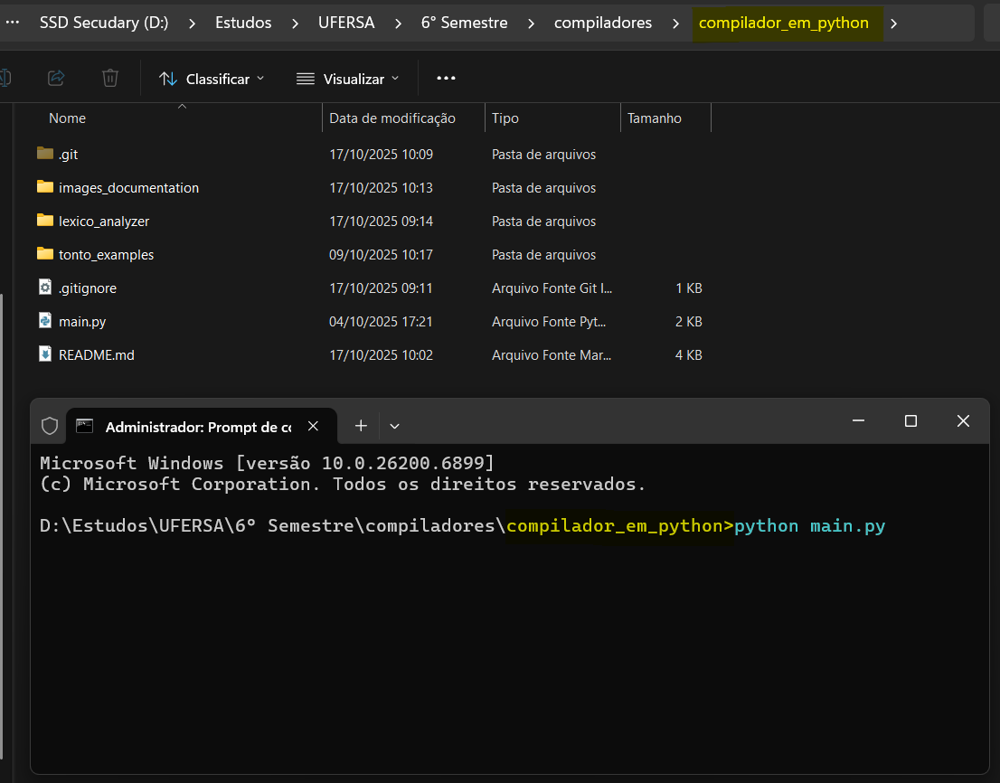

### <a name="executar-ide"></a> Usando uma IDE:

Basta selecionar o arquivo `main.py` e clicar no botão 'run' da IDE.

Exemplo com o VS Code (clicar onde estão as setas vermelhas):

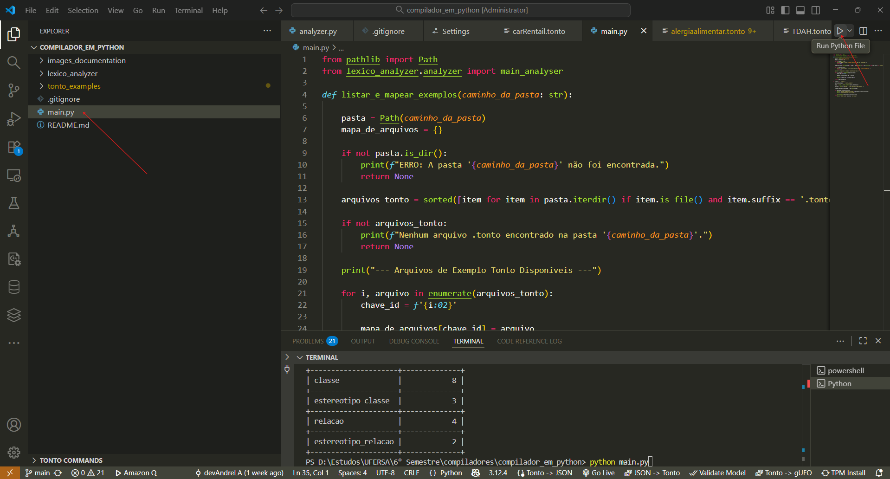

### <a name="entrada-sistema"></a> Entrada do sistema 

Seja em prompt ou em IDE, aparecerá um catálogo com todos exemplos da pasta `tonto_examples` enumerados.

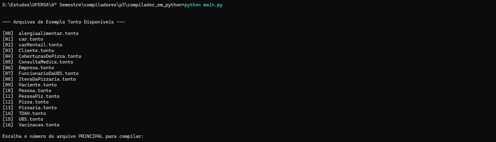

Para executar o compilador no exemplo escolhido basta digitar o respectivo número, por exemplo, se quiser executar o `car.tonto`, digite 01 e tecle 'enter' no seu teclado.

### <a name="saida-sistema"></a> Saída do sistema 

- Confirmação do arquivo escolhido;
- Breve log de executando e concluído;
- Tabela de tokens:

    - Id do Token,
    - Valor encontrado,
    - Tipo do valor (classe, relação, instância ou o próprio valor (caso seja palavra-chave ou terminal))
    - Linha que o token está,
    - Coluna que o token inicia,
    - Classificação conforme o que foi dado no arquivo (classes, relações, palavras-chave, indivíduos (instâncias, se houver), 
palavras reservadas e meta-atributos)

- Tabela de contagem das classificações,
- Tabela sintática:

    - mostrando as classes e entidade,
    - atributos,
    - relações,
    - detalhes de generalização ou especificação

- Tabela de contagem de classificações sintáticas, 
- Tabelas de análise semântica (padrões completos e incompletos(use de coerção para tratamento de erros))

    - mostrando os padrões usados,
    - detalhes,
    - arquivo,
    - linha


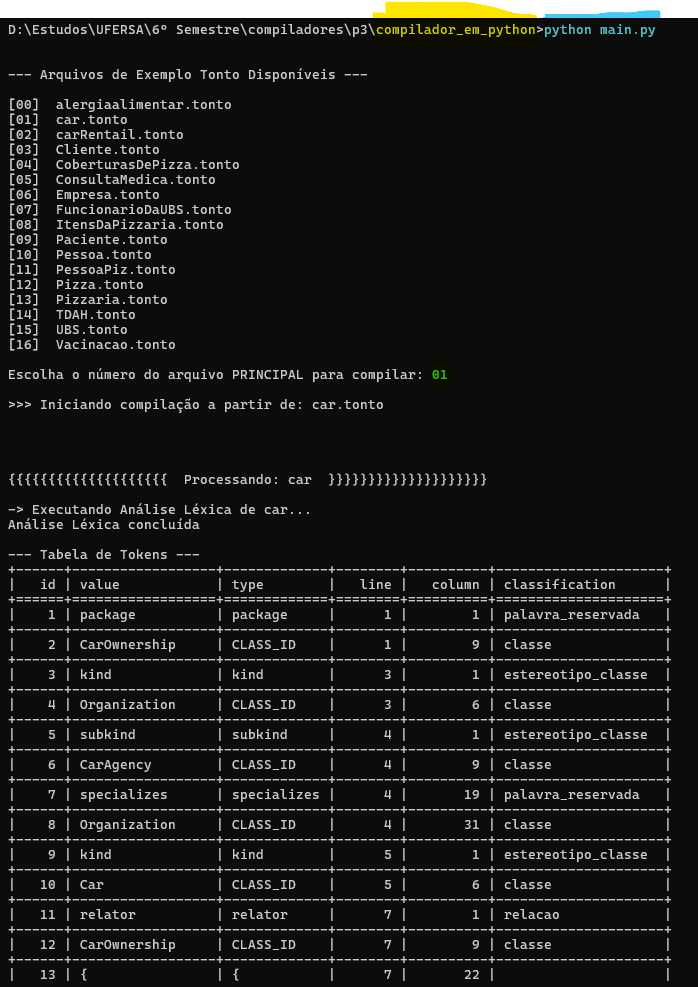

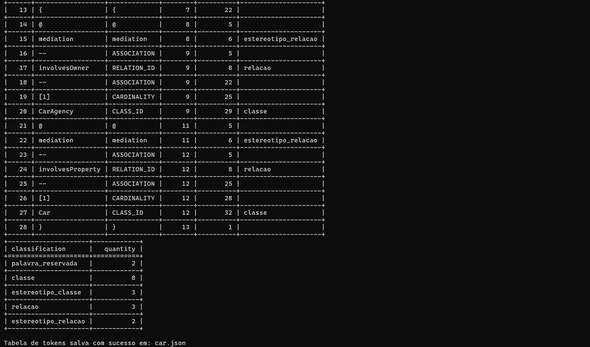

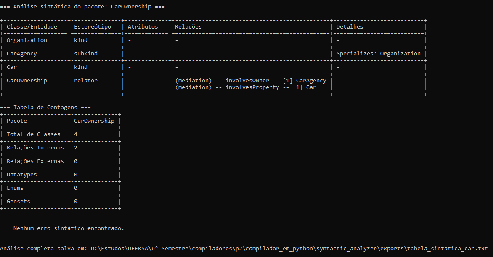

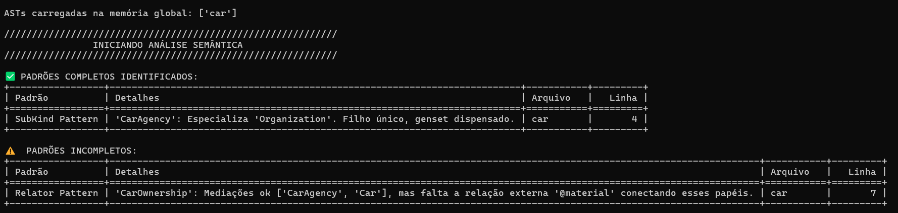

- Arquivo .json no diretório lexico_analyzer/exports/

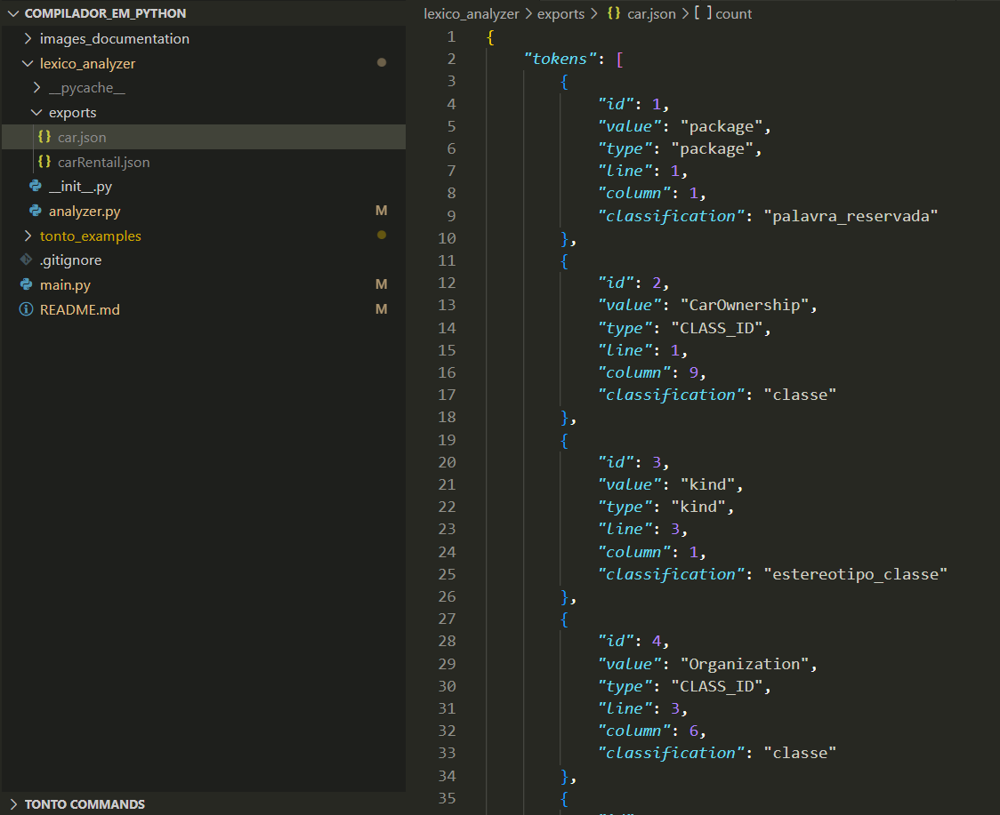

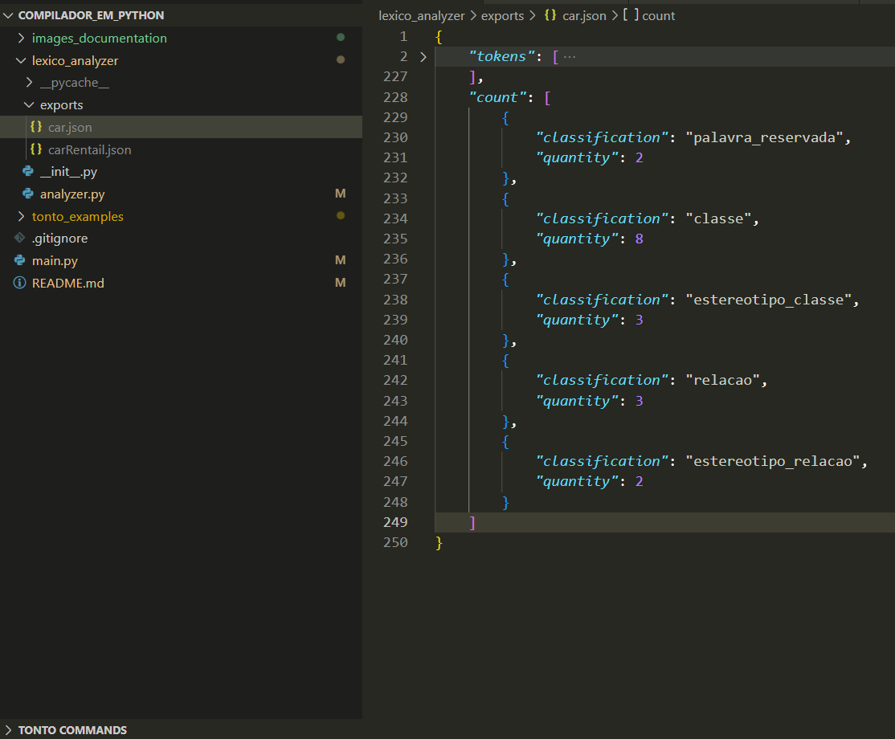


- Arquivo .txt no diretório syntatic_analyzer/exports/

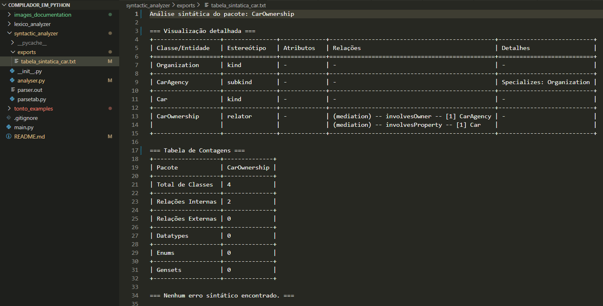


- Arquivo .txt no diretório semantic_analyzer/exports/

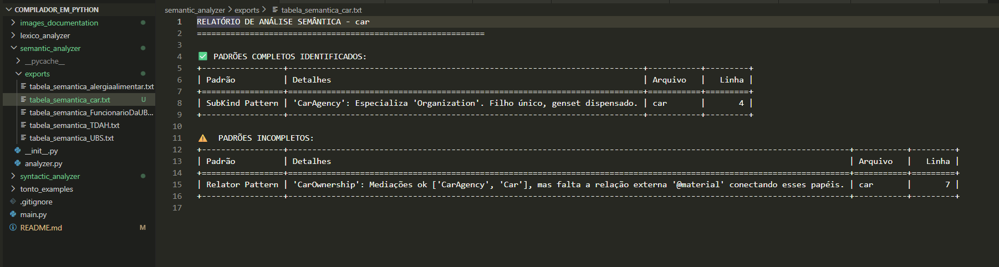


# <a name="apresentacao1"></a> Apresentação 1 no youtube (Analizador Léxico)

https://www.youtube.com/watch?v=cwgRQqRoW5M

# <a name="apresentacao2"></a> Apresentação 2 no youtube (Analizador Sintático)

https://www.youtube.com/watch?v=FaPRFwai1do

# <a name="apresentacao3"></a> Apresentação 3 no youtube (Analizador Semântico)

https://www.youtube.com/watch?v=giDHcsMpi6o

# <a name="criadores"></a> Criadores:

- André de Lima Alves,
- Lucas Gabriel de Melo Rodrigues.